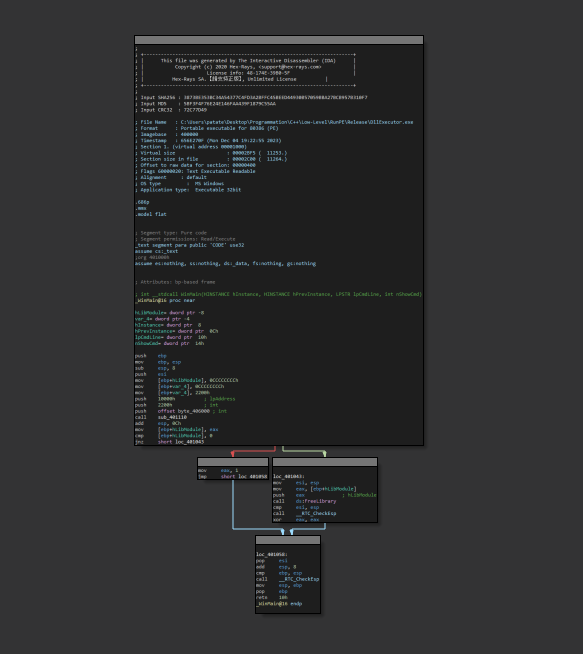
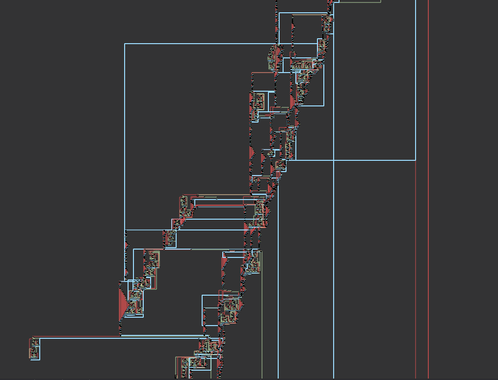

# patate-crypter
I am not responsible for any damage caused by this program. It was made as a learning experiment to gather more knowledge about anti virus.<br>
The project structure is **very** messy because i wasn't planning on releasing it, sorry i guess.<br>
I will not provide any support for running the program, it is only made for people interested in cyber security to learn more about how AV work.

# Limitations
patate crypter officially supports 32bit DLLs and PEs. It might be possible to add x64 bit support without too much issues, but i never tried, maybe one day.<br>
The crypter will link the library dynamically by default because statically linking the MSVC default librairies cuases the detections to go from 0/40 to 5/40 (see below).<br>
There is an issue where the reallocations would fail for specific payloads, TOFIX.<br>
There is code in the `metadata.py` file to generate random BMP images in the metadata of the PE but it makes the entropy go way to high (from 6.4 to 7.4) (see [link](https://practicalsecurityanalytics.com/file-entropy/)).

# Detection rate
There is currently 0/40 detections for a crypted meterperter :
- [original](https://kleenscan.com/scan_result/c6ee0a65f7b88ff709b003357ba9e21a2c1488ad7c6f2314d00bdae45d542df8)
- [crypted (dynamically linked)](https://kleenscan.com/scan_result/be8a5e779c0269d2a87d9345118e180162852c4ed70e18f17838da8f879e87ae)
- [crypted (statically linked)](https://kleenscan.com/scan_result/0b65052a51ce5d3f7807fdae4c7ffc1c45f2868ab41f9073c3bd479b2c86b2a8)

# How does it work ?
The crypter (compile time) works by :
- storing the raw bytes of the payload into a buffer (XOR encrypted)
- adding junk code/control flow flattening to the decryption stub
- copying a Windows file signature on the generated PE (using [SigThief](https://github.com/secretsquirrel/SigThief))

Then the stub (at runtime) :
- decrypts the sections of the payload one by one and encrypts them back after copying them into the memory (bypasses ESET AV emulation)
- rebases the payload to its new base address
- calls (Dll)main

Here are screenshots of the same function before and after the obfuscation pass :<br>
Without obfuscation : <br>
<br>
With obfuscation (only showing a few nodes, the original graph was more than 40K nodes) : <br>
<br>

# How to run
```
cd Builder
python gui.py
```
